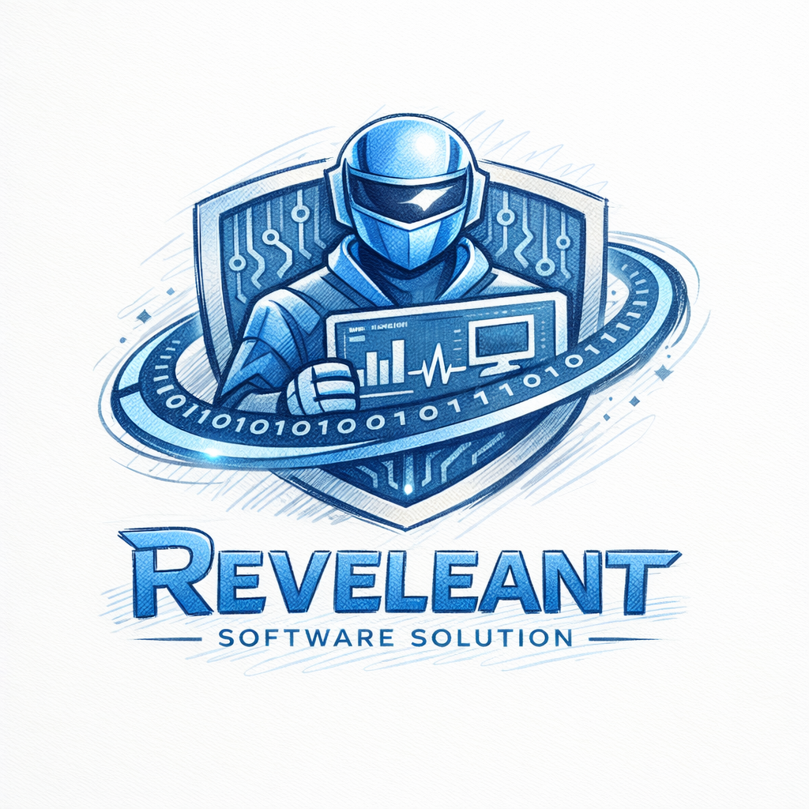
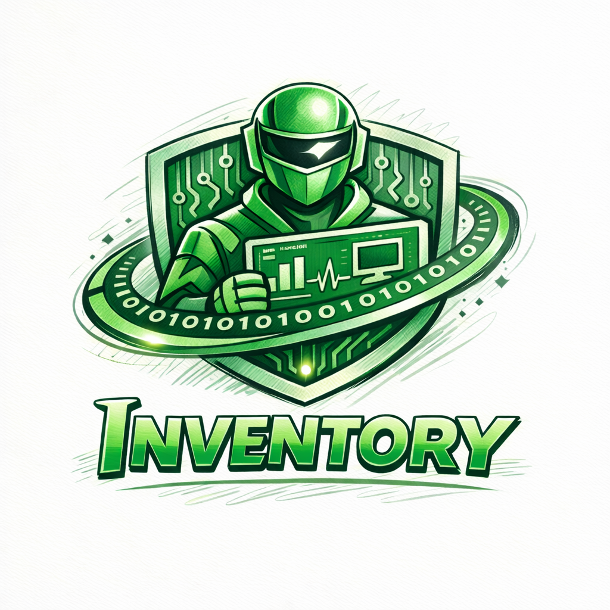

# 🚀 Relevant-Solution

  

### 🧑‍💼 Lead Product Manager
* **Samuel Collado**

### 👥 Participants
* **Gineys Emilien**
* **Perico Couture**
* **Mathis Gubien**
* **Djessim Slimani**

---

  

## 🛠 Inventory

### 📥 Étapes d'installation

1. **Téléchargement** : Récupérer l'exécutable depuis les releases.
2. **Lancement** : Exécuter le fichier binaire sur votre machine.

### 🏁 Résultat
La solution est maintenant disponible et accessible via :
> 🔗 **URL** : `http://localhost:8080`

---

  

## 🛠 Build Up

### 📥 Étapes d'installation

### 🏁 Résultat

---
*Dernière mise à jour : Février 2026*